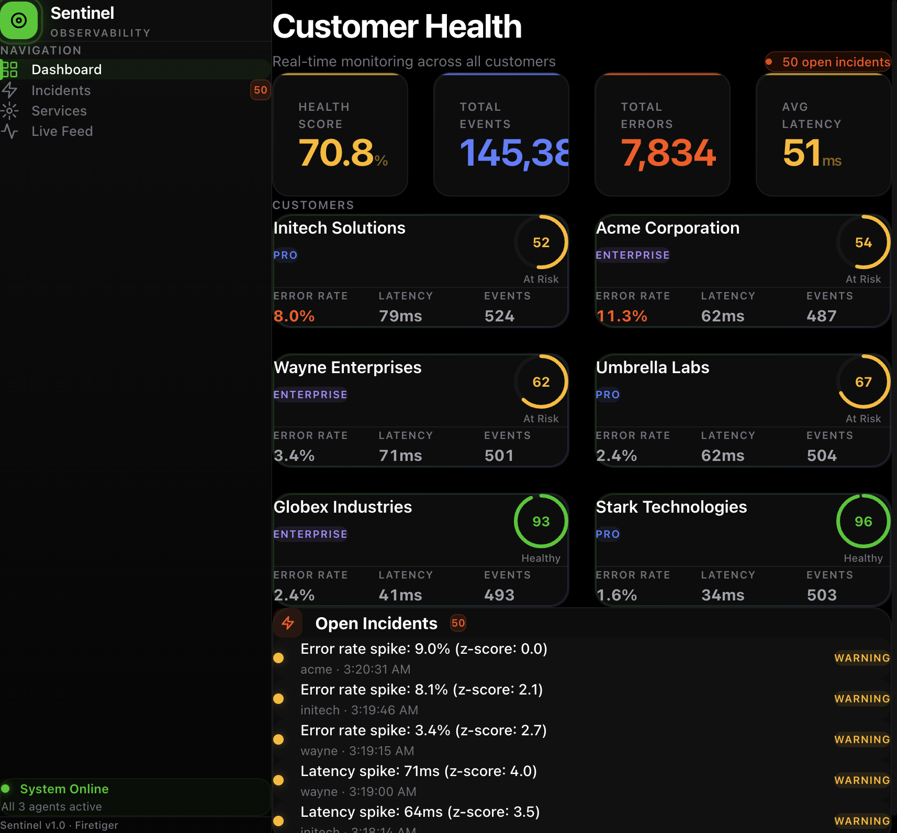
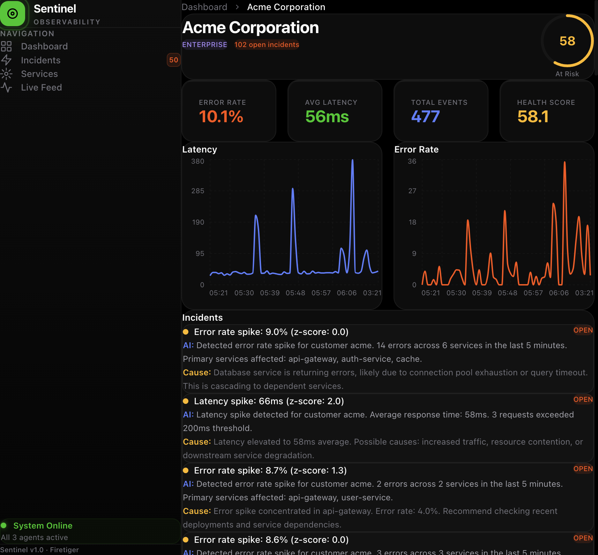
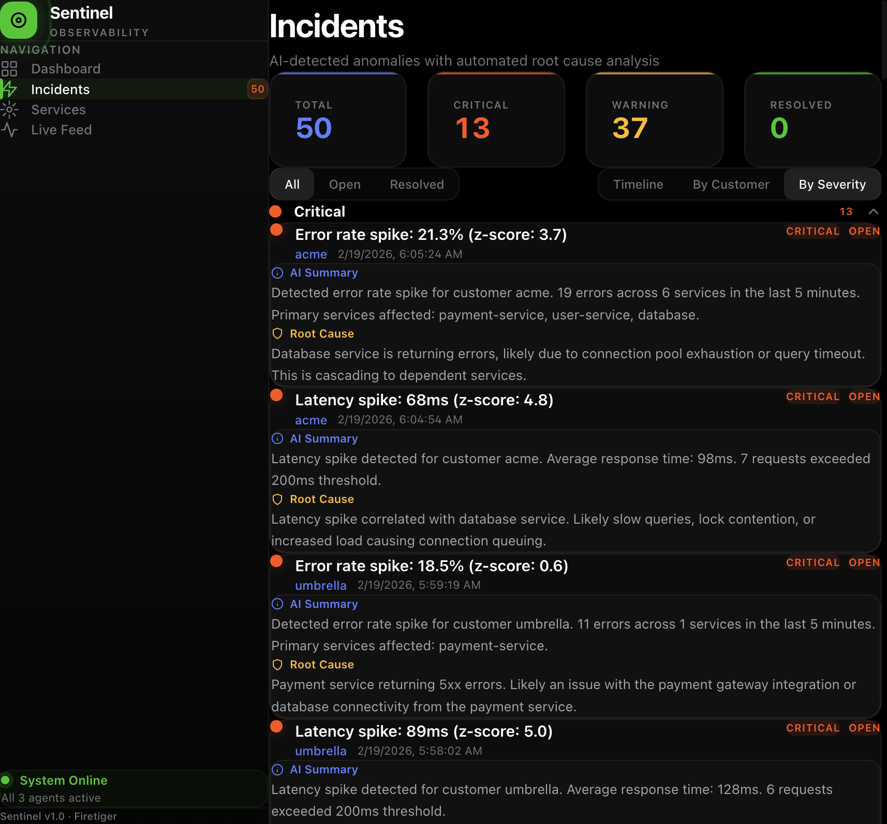
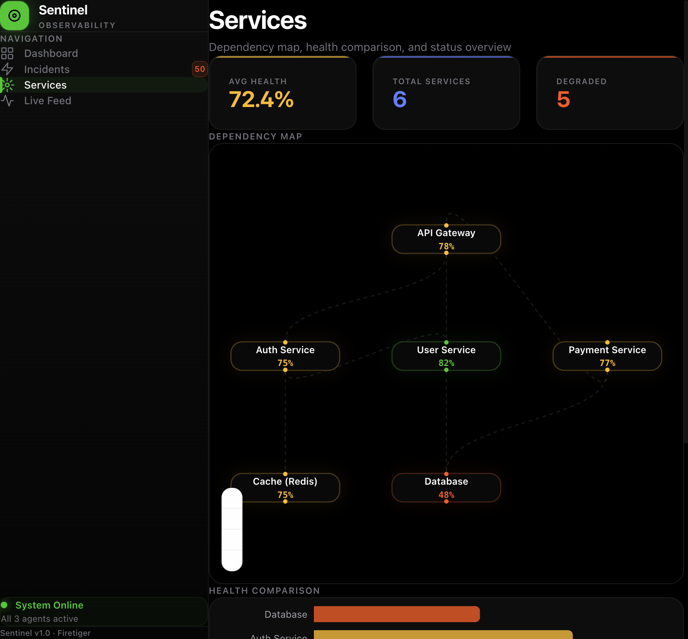
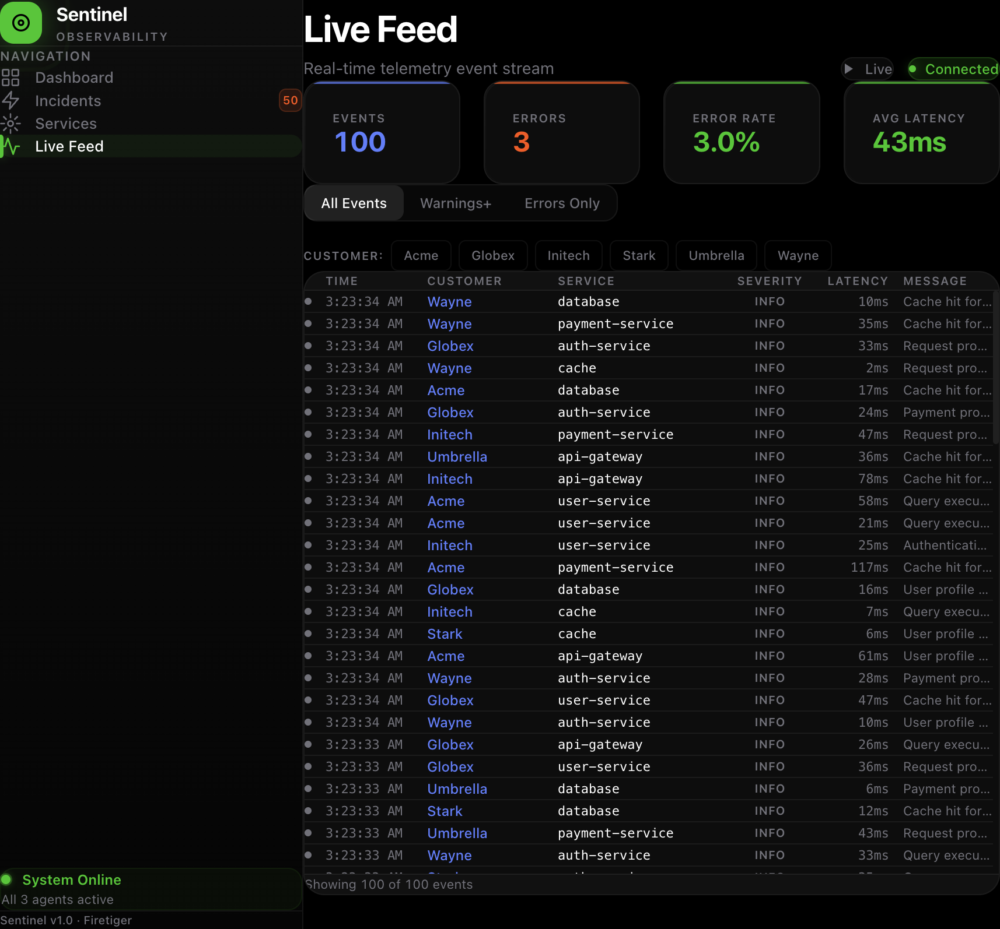

# Sentinel — AI-Powered Customer Health Monitor

An observability platform that uses AI agents to detect, investigate, and explain production issues **before customers report them**.

Unlike traditional monitoring tools (Datadog, New Relic, Grafana) that are service-centric, Sentinel monitors health **per-customer** and uses AI to automatically generate root cause analysis when anomalies are detected.



---

## The Problem

Traditional monitoring tells you *"the payment service has a 5% error rate."* But it doesn't tell you **which customers** are impacted.

Your database might have 3% errors overall — looks fine. But all those errors could be hitting one enterprise customer who's seeing a 20% error rate. They're furious, and you don't know until they file a support ticket 3 hours later.

**Sentinel solves this** by tracking per-customer health scores, detecting statistical anomalies against each customer's individual baseline, and dispatching an AI agent to investigate and explain what went wrong — all automatically.

---

## Screenshots

| Dashboard | Customer Detail |
|:-:|:-:|
|  |  |

| Incidents (By Severity) | Service Dependency Map |
|:-:|:-:|
|  |  |

| Live Event Feed |
|:-:|
|  |

---

## Architecture

```
┌──────────────┐         ┌───────────────────────────────────┐         ┌─────────────────┐
│    Event      │────────▶│          FastAPI Backend           │────────▶│  React Frontend │
│  Simulator    │  POST   │                                   │  SSE +  │  (Real-time     │
│              │ /events  │  ┌─────────┐  ┌───────────────┐  │  REST   │   Dashboard)    │
└──────────────┘  /batch  │  │ Health  │  │   Anomaly     │  │         └─────────────────┘
                          │  │ Engine  │  │  Detector     │  │
                          │  │ (15s)   │  │  (z-scores)   │  │
                          │  └────┬────┘  └───────┬───────┘  │
                          │       │               │          │
                          │       ▼               ▼          │
                          │  ┌──────────────────────────┐    │
                          │  │   AI Investigator Agent   │    │
                          │  │  (Gemini + rule fallback) │    │
                          │  └──────────────────────────┘    │
                          │                                   │
                          │         SQLite (async)            │
                          └───────────────────────────────────┘
```

### Pipeline Stages

1. **Ingestion** — Events are received via REST API, stored in SQLite, and broadcast to SSE subscribers
2. **Health Engine** (every 15s) — Computes weighted health scores per customer: 40% error rate, 30% latency, 30% availability
3. **Anomaly Detector** (every 15s) — Z-score statistical detection against each customer's rolling baseline, with cooldown to prevent duplicate alerts
4. **AI Investigator** (on-demand) — Triggered per incident; Gemini AI generates summary + root cause, with rule-based fallback if unavailable

All background agents run as async tasks inside the same FastAPI process — no Redis, no message queues, no separate workers.

---

## Key Design Decisions

### 1. Customer-Centric vs Service-Centric Monitoring

Health scores are computed per-customer, not per-service. A service-level 3% error rate can hide one customer's 20% error rate. Customer-centric monitoring surfaces these hidden problems.

**Trade-off**: O(customers × services) computation instead of O(services). Acceptable at this scale; at 10K+ customers, you'd batch/partition.

### 2. Z-Score Detection vs Fixed Thresholds

A hard threshold like "alert if errors > 5%" doesn't adapt to baselines. A customer at 0.1% spiking to 2% is a 20x increase but would be missed. Z-scores measure deviation from each customer's individual normal.

```
z_score = (current_value - mean) / standard_deviation
```

- Rolling window of 30 data points per customer
- Threshold: z > 2.0 (more than 2 standard deviations)
- Combined with absolute thresholds as safety nets

**Trade-off**: Needs warm-up period (~3 min). Absolute thresholds catch early anomalies. Z-scores also miss gradual degradation — a production system would add trend detection.

### 3. SSE vs WebSockets

Data flow is one-directional (server → client). SSE is simpler: HTTP GET that stays open, browser handles reconnection automatically via EventSource API. No protocol upgrade, no bidirectional handling needed.

**Trade-off**: No client-to-server messaging through the stream. Filters are applied client-side on the received stream.

### 4. AI + Rule-Based Fallback

The investigator tries Gemini AI first, falls back to pattern-matching rules if the API key isn't set or the call fails. You can't depend on an external API for a critical monitoring path.

**Trade-off**: Rule-based fallback is less nuanced but is deterministic, instant, and never fails.

### 5. Background Async Tasks vs Separate Workers

Health engine and anomaly detector run as `asyncio.create_task()` inside FastAPI. Zero infrastructure overhead.

**Trade-off**: Won't scale past ~100K events/sec. In production, agents would become microservices consuming from Kafka/NATS. The interface wouldn't change — just the transport layer.

---

## Tech Stack

| Layer | Technology | Why |
|-------|-----------|-----|
| **Backend** | Python 3.11+ / FastAPI | Async-native for SSE streaming, background tasks, and non-blocking DB queries in one process |
| **Database** | SQLAlchemy + aiosqlite (SQLite) | Full async ORM. Zero setup. Swap to Postgres with one connection string change |
| **AI** | Google Gemini (gemini-2.0-flash) | Cost-effective, fast inference (<2s), generous free tier |
| **Frontend** | React 19 + TypeScript + Tailwind CSS 4 | Type-safe components, utility-first styling, dark mode |
| **Charts** | Recharts | Composable React charts for time-series and bar comparisons |
| **Service Map** | React Flow (@xyflow/react) | Interactive node-based dependency graph |
| **Real-time** | Server-Sent Events | Simpler than WebSockets for one-way server push |
| **Build** | Vite | Sub-second HMR, fast builds |

---

## Features

### Health Dashboard
Customer cards with color-coded health scores (green/yellow/red), sorted worst-first. KPI cards show system-wide pulse: overall health, total events, errors, average latency. Updates live every 10 seconds.

### Customer Detail
Per-customer deep dive with health ring, time-series charts for latency and error rate, recent incidents with AI-generated summaries, and an events table.

### Incident Management
Three view modes for different stakeholders:
- **Timeline** — chronological list of all incidents
- **By Severity** — critical/warning/info grouped with collapsible headers
- **By Customer** — incidents grouped by company with per-group severity counts

Each incident includes AI-generated summary, root cause analysis, severity badge, and status.

### Service Dependency Map
Interactive graph showing service relationships (API Gateway → Auth → Database, etc.) with health-colored nodes. Accompanied by a horizontal health comparison bar chart and service detail cards.

### Live Event Feed
Real-time SSE-powered stream with:
- Live-computed stats (events, errors, error rate, latency)
- Severity filter (All / Warnings+ / Errors Only)
- Customer filter (toggle per customer)
- Pause/resume auto-scroll for inspection

---

## Quick Start

### Prerequisites

- Python 3.9+
- Node.js 18+
- (Optional) [Google Gemini API key](https://aistudio.google.com/apikey) for AI-powered investigation

### 1. Start the Backend

```bash
cd backend
pip3 install -r requirements.txt
python3 -m uvicorn main:app --port 8000
```

### 2. Start the Frontend

```bash
cd frontend
npm install
npm run dev
```

### 3. Start the Event Simulator

```bash
cd backend
python3 -u simulator.py
```

### 4. (Optional) Enable AI Investigation

```bash
export GEMINI_API_KEY=your-api-key-here
```

Restart the backend after setting the key. Without it, the system uses rule-based analysis as a fallback.

### 5. Open the Dashboard

Visit [http://localhost:5173](http://localhost:5173)

Within ~30 seconds you'll see customers appear with health scores. Anomalies are injected periodically by the simulator, triggering automatic detection and AI investigation.

---

## Project Structure

```
sentinel/
├── backend/
│   ├── agents/
│   │   ├── detector.py        # Z-score anomaly detection
│   │   ├── health.py          # Per-customer health scoring
│   │   └── investigator.py    # AI root cause analysis (Gemini + fallback)
│   ├── routes/
│   │   ├── customers.py       # Customer list, detail, metrics
│   │   ├── events.py          # Event ingestion, stats, SSE stream
│   │   ├── incidents.py       # Incident CRUD and status updates
│   │   └── services.py        # Service list and health
│   ├── database.py            # Async SQLAlchemy + SQLite setup
│   ├── main.py                # FastAPI app, CORS, lifespan, routes
│   ├── models.py              # ORM models (Event, Customer, Incident, Service)
│   ├── simulator.py           # Telemetry generator with anomaly injection
│   └── requirements.txt
│
├── frontend/
│   ├── src/
│   │   ├── components/
│   │   │   ├── Dashboard.tsx       # Main health overview
│   │   │   ├── CustomerDetail.tsx  # Per-customer deep dive
│   │   │   ├── IncidentTimeline.tsx # Multi-view incident management
│   │   │   ├── ServiceMap.tsx      # Dependency graph + health chart
│   │   │   ├── LiveFeed.tsx        # Real-time event stream
│   │   │   ├── HealthScore.tsx     # Reusable SVG health ring
│   │   │   └── Layout.tsx          # Sidebar navigation + layout
│   │   ├── hooks/
│   │   │   └── useSSE.ts           # Server-Sent Events hook
│   │   ├── lib/
│   │   │   └── api.ts              # API client
│   │   ├── App.tsx
│   │   ├── main.tsx
│   │   └── index.css               # Global styles + animations
│   ├── package.json
│   └── vite.config.ts
│
└── README.md
```

---

## Algorithm Details

### Health Score

```
health_score = (error_score × 0.4) + (latency_score × 0.3) + (availability_score × 0.3)
```

| Component | Formula | 0% errors / 100ms latency | 10% errors / 300ms latency |
|-----------|---------|--------------------------|---------------------------|
| Error Score | `max(0, 100 - error_rate × 500)` | 100 | 50 |
| Latency Score | `max(0, 100 - max(0, (p95 - 100) × 0.5))` | 100 | 0 |
| Availability | `max(0, (1 - error_rate) × 100)` | 100 | 90 |

Errors are weighted highest (40%) because a failed request is worse than a slow one.

### Anomaly Detection Thresholds

| Type | Statistical Trigger | Absolute Trigger |
|------|-------------------|-----------------|
| Error Spike | z > 2.0 AND error_rate > 3% | error_rate > 8% |
| Latency Spike | z > 2.0 AND latency > 60ms | latency > 100ms |

**Severity**: Critical if error_rate > 15%, latency > 200ms, or z > 4. Warning otherwise.

**Cooldown**: 3-minute cooldown per (customer, anomaly_type) pair to prevent duplicate incidents.

---

## What I'd Still Add

| Addition | Why It Matters |
|----------|---------------|
| **Slack/PagerDuty alerting** | Detection without notification is a dashboard nobody watches |
| **Predictive analytics** | Z-scores miss slow degradation; trend detection catches "will breach SLA in 3 days" |
| **Distributed tracing** | Link AI root causes to actual slow queries via OpenTelemetry trace IDs |
| **Multi-tenant auth** | JWT + role-based access so each customer sees only their own data |
| **PostgreSQL** | SQLite is single-writer; concurrent load needs a production database |
| **Incident auto-resolution** | Auto-close when anomaly subsides, calculate MTTR |

---

## License

MIT
